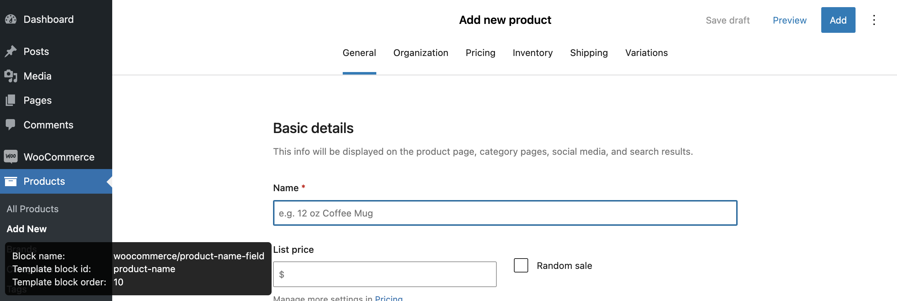

# WooCommerce Block Template Inspector

This plugin enables an experimental block template inspector to help with development and debugging of the new product editor. For use only on development sites. Do not use on production sites.

## Installation

1. Install and activate this plugin.

## How to use

1. Enable the new product editor by going to WooCommerce > Settings > Advanced > Experimental features > New product editor.
2. Bring up the new product editor by going to Products > Add New.
3. Focus on any field in the product editor.
4. An inspector will show in the bottom left corner of the screen showing the following information:
   - Block name
   - Template block id
   - Template block order

## Frequently Asked Questions

### How do I disable the inspector?

Disable the WooCommerce Block Template Inspector plugin.
